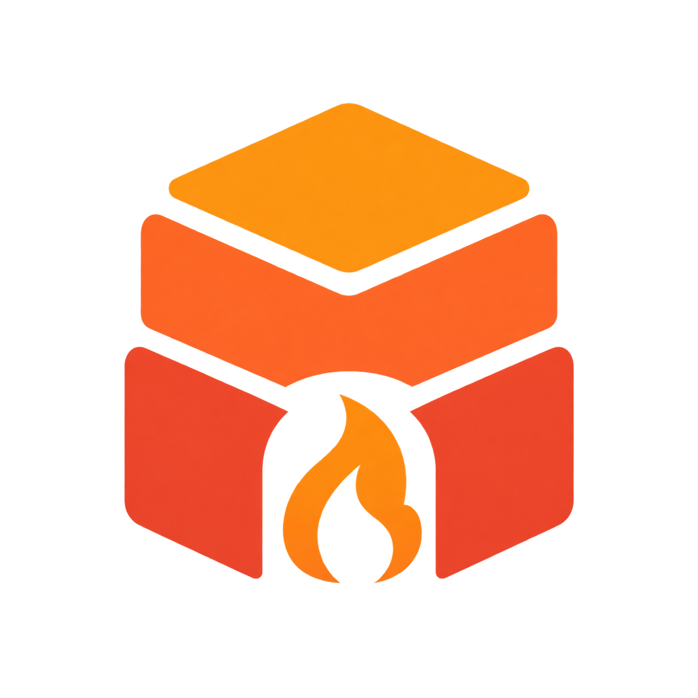

<p align="center">
  
</p>

<h1 align="center">Stackiln</h1>

<p align="center"><strong>Shape a product from composable modules. Ship code you own.</strong></p>

Stackiln is a modular TypeScript framework and CLI that generates standalone, production-oriented Next.js products. It combines a small deployable base with explicit feature recipes, plans every file before writing, and records ownership hashes so generated code can evolve without silently replacing product customisations.

> **Project status:** alpha. The marketing preset, 60-family public block catalogue, four page recipes, and optional accounts module are implemented. Other presets are reserved by the schema but are not complete yet. See the [roadmap](ROADMAP.md) before choosing Stackiln for production work.

## Why Stackiln

- **Own the output:** generated applications have no Stackiln runtime dependency.
- **Compose intentionally:** modules declare their files, routes, tables, environment variables, permissions, events, dependencies, and conflicts.
- **Preview safely:** `--plan` is read-only; creation happens in a sibling staging directory and commits only after validation.
- **Protect changes:** `.stackiln/state.json` records managed-file checksums for conflict detection.
- **Verify the real product:** the repository gate covers generation, migrations, builds, browser journeys, and the container image.

## Quick start

Requirements: Node.js 24, pnpm 9, and Docker Desktop or Docker Engine with Compose. On Windows PowerShell, use `pnpm.cmd` if the execution policy blocks `pnpm.ps1`.

```sh
git clone https://github.com/ChristianRelf/Stackiln.git
cd Stackiln
pnpm install --frozen-lockfile
pnpm stackiln create my-product --preset marketing --name "My Product" --description "A clear description"
cd my-product
pnpm install --frozen-lockfile
docker compose up -d --wait db
pnpm db:migrate
pnpm dev
```

The generated app runs at `http://localhost:3000`. Copy `.env.example` to `.env.local` and review every setting before deployment.

Add verified email/password accounts with `--module accounts`. In production, set `BETTER_AUTH_SECRET` to a unique random value of at least 32 characters. The module includes its Drizzle migration, so the same `pnpm db:migrate` step applies.

## CLI

```text
pnpm stackiln create <directory> --preset marketing --name "Name" [options]
pnpm stackiln blocks list
pnpm stackiln blocks show <block-id>
pnpm stackiln recipes list
pnpm stackiln inspect [directory] [--json]
pnpm stackiln doctor [directory] [--json]
pnpm stackiln context [directory] [--write]
pnpm stackiln verify
```

Useful create options:

- `--module accounts` enables an optional module; repeat the flag for more modules.
- `--recipe saas-launch` selects one of four composed public page recipes.
- `--block hero.centered` selects an exact block set; repeat it to build the page order.
- `--description "..."` sets the generated product description.
- `--plan` prints the exact plan without writing files.
- `--json` emits machine-readable output where supported.

## Development

```sh
pnpm install --frozen-lockfile
pnpm typecheck
pnpm test
pnpm lint
pnpm verify
```

`pnpm verify` is the canonical gate. It requires Docker and validates the framework, independent marketing and accounts fixtures, PostgreSQL migrations, desktop and mobile Playwright journeys, and a non-root production container.

Architecture and extension points are documented in [docs/architecture.md](docs/architecture.md), [docs/module-authoring.md](docs/module-authoring.md), and [docs/block-authoring.md](docs/block-authoring.md). Release progress is tracked in [docs/build-progress.md](docs/build-progress.md).

## Community and security

Contributions are welcome. Read [CONTRIBUTING.md](CONTRIBUTING.md), the [Code of Conduct](CODE_OF_CONDUCT.md), and [SUPPORT.md](SUPPORT.md) before opening an issue or pull request. Please report vulnerabilities privately as described in [SECURITY.md](SECURITY.md).

## License

Stackiln is available under the [MIT License](LICENSE). You may use, copy, modify, distribute, sublicense, and sell the software subject to the license notice. Generated products are yours to use and adapt; see [docs/generated-code.md](docs/generated-code.md) for the small attribution obligation that follows copied MIT-licensed source.
